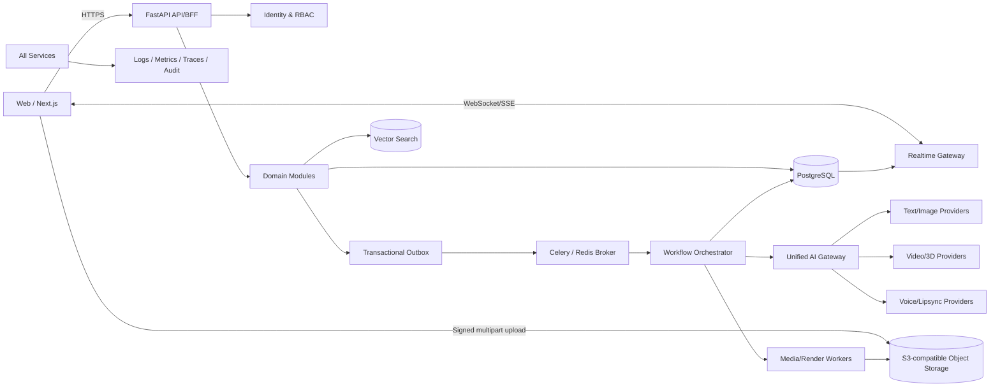
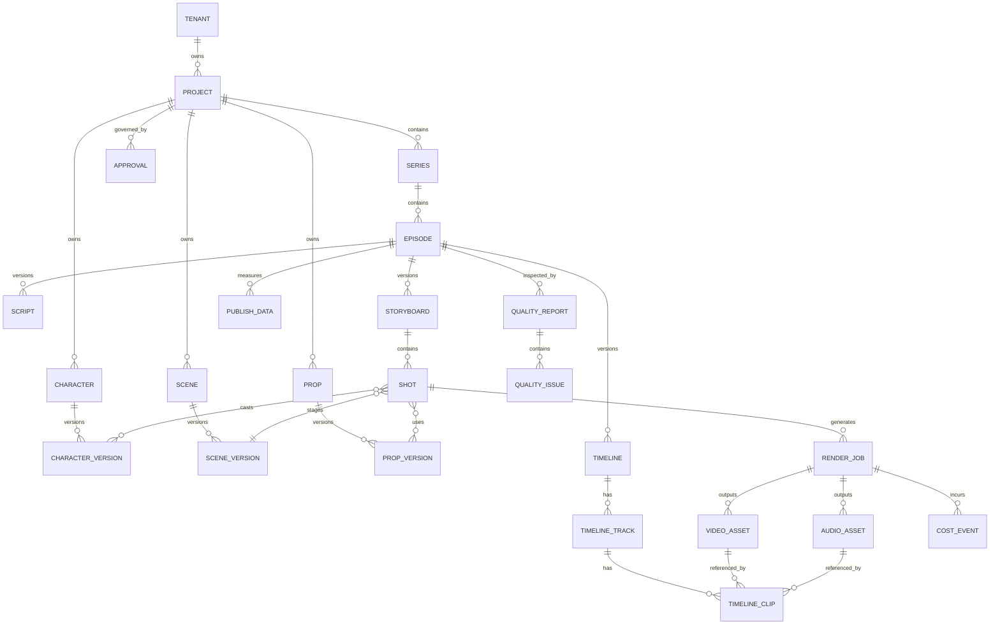

# 《AI3DDramaFactory V1 完整产品架构设计方案》

> 文档状态：待评审（Draft for Approval）  
> 版本：V1.0  
> 日期：2026-07-30  
> 阶段约束：本文仅定义产品与技术方案，不启动代码开发、旧系统备份或迁移。  
> 产品定位：面向中国短剧与 3D 国风动漫 IP 的 **AI 漫剧生产操作系统（Digital Drama Factory）**，不是单点 AI 视频生成网站。

---

## 0. 执行摘要与决策请求

AI3DDramaFactory 将“市场洞察—IP/小说—剧本—角色/场景资产—导演分镜—镜头生产—声音/口型—专业剪辑—质量审核—发布—数据反馈”固化为可审核、可追踪、可返修、可复用、可计费的工业流水线。

V1 的产品主线不是增加更多 AI 按钮，而是建立四个不可绕过的生产约束：

1. **可视化关卡**：每个阶段都有工作台、产物、状态、责任人和审核门禁。
2. **结构化生产**：Project、Episode、CharacterVersion、Shot、Timeline 等是一等业务对象；Prompt 只是对象的一个派生字段。
3. **资产引用而非重抽**：正式镜头必须绑定已锁定角色、场景、道具及风格版本。
4. **全链路可追溯**：一次生成可追到输入快照、模型、参数、种子、成本、输出、审核与返修原因。

### 0.1 本轮需确认的架构决策

| 编号 | 决策 | 推荐结论 |
|---|---|---|
| D1 | V1 首发内容类型 | 竖屏 9:16、单集 1–3 分钟、3D 国风漫剧 |
| D2 | V1 租户形态 | 多租户 SaaS 架构，首期可单租户部署 |
| D3 | 生产门禁 | 未锁定 CharacterVersion / SceneVersion 不得进入正式渲染 |
| D4 | AI 接入方式 | 所有模型只经统一 AI Gateway，禁止业务服务直连供应商 |
| D5 | 编辑器策略 | 浏览器非破坏性时间线；服务端生成代理文件、预览与成片 |
| D6 | V1 成功标准 | 用真实资产完整生产并返修一集，而非页面数量或生成次数 |
| D7 | 旧系统策略 | 先只读盘点与完整备份，再按白名单抽取基础能力；禁止整库搬迁 |

---

# 第一篇：产品 PRD

## 1. 产品愿景、边界与目标用户

### 1.1 产品愿景

让制片团队在同一个可控系统中，把一个市场机会转化为可发布的系列漫剧，并让每一集积累可复用的数字影视资产和生产数据。

### 1.2 产品边界

**V1 要做：**

- 项目、系列、集、资产、镜头、时间线的统一生产数据模型。
- 小说导入/分析、剧本结构化、角色与场景资产版本管理。
- 镜头卡、生成任务、人工审核、返修、成本归集。
- 多供应商视频/图片/文本/语音模型路由。
- 可人工调整的多轨时间线、代理媒体和非破坏性编辑。
- 一致性与技术质量检查、发布包和运营数据回流。

**V1 不做：**

- 自研基础生成模型或 DCC/游戏引擎的完整替代品。
- 无人值守自动发布或未经审核的“一键成片”。
- 为覆盖场景而保留旧系统的所有页面、Agent 和假状态。
- 以自由 Prompt 作为唯一生产数据。
- 首期同时适配所有横竖屏、所有美术风格和所有发行渠道。

### 1.3 核心用户与权限

| 角色 | 核心任务 | 关键权限 |
|---|---|---|
| 出品人/项目负责人 | 立项、预算、进度、终审 | 项目配置、预算审批、发布批准 |
| 编剧 | 小说分析、季纲、分集、剧本 | 文本编辑、版本提交、内容锁定申请 |
| 美术/资产主管 | 角色、场景、道具、风格圣经 | 创建资产版本、质量校验、资产锁定 |
| 导演/分镜师 | 场面调度、镜头设计、预演 | Storyboard/Shot 编辑、镜头批准 |
| AI 制片/生成师 | 生成策略、任务重试、供应商路由 | RenderJob 操作、参数模板管理 |
| 声音/剪辑师 | 配音、口型、音乐、多轨剪辑 | AudioAsset、Timeline 编辑与导出 |
| 质检 | 一致性、技术、剧情检查 | QualityReport、阻断/放行建议 |
| 财务/运营 | 成本、发布表现、复盘 | 成本查询、PublishData 导入与分析 |
| 管理员 | 租户、成员、权限、供应商密钥 | RBAC、密钥、审计、系统策略 |

采用租户级 RBAC + 项目成员角色 + 资源级 ACL；锁定、终审、预算超限和发布属于高风险动作，必须单独授权并记录审计日志。

## 2. 核心概念与生产状态机

### 2.1 业务层级

```text
Tenant
└── Project（作品项目）
    └── Series（季/系列）
        └── Episode（集）
            ├── Script → Storyboard → Shot → RenderJob → VideoAsset
            ├── AudioAsset
            ├── Timeline
            └── QualityReport → Approval → Release Package

Project Asset Library
├── Character → CharacterVersion
├── Scene → SceneVersion
├── Prop → PropVersion
└── StyleBible / VoiceProfile / MotionClip
```

### 2.2 统一产物生命周期

`DRAFT → GENERATING → REVIEW_REQUIRED → CHANGES_REQUESTED → APPROVED → LOCKED → SUPERSEDED/ARCHIVED`

- `APPROVED` 表示某次审核通过；`LOCKED` 表示可作为下游正式生产依赖。
- 修改已锁定版本时必须创建新版本，不可覆写；旧版本继续服务历史镜头。
- 下游产物记录上游版本快照。上游升级不会静默改变已批准镜头，而是产生“依赖已过期”提示。
- 所有 AI 产物首先进入 `REVIEW_REQUIRED`，禁止直接进入 `APPROVED/LOCKED`。

### 2.3 集级生产关卡

| 关卡 | 必备输入 | 可视化产物 | 放行条件 |
|---|---|---|---|
| G0 立项 | 市场机会、受众、预算 | 项目简报、爆款评分、风险 | 负责人批准 |
| G1 故事 | 原著/原创设定 | 世界观、人物关系、48 集规划 | 编剧+制片批准 |
| G2 剧本 | 分集目标 | 场次化剧本、对白、动作 | 剧本锁定 |
| G3 资产 | 风格圣经、角色/场景需求 | 角色/场景/道具版本 | 资产主管锁定 |
| G4 分镜 | 锁定剧本与资产 | Storyboard、Shot、预演 | 导演批准 |
| G5 镜头 | 批准的 Shot | 图片/视频/音频候选 | 逐镜批准；失败可追踪 |
| G6 剪辑 | 批准媒体 | 多轨 Timeline、预览 | 剪辑锁定 |
| G7 质检 | 锁定时间线 | 质量报告、问题定位 | 无阻断项、终审批准 |
| G8 发布 | 合格母版 | 渠道包、元数据 | 发布批准 |
| G9 复盘 | 渠道指标 | 留存/互动分析、改进建议 | 进入下一轮选题与制作 |

## 3. 功能需求

### 3.1 AI 漫剧驾驶舱

- 单一作品上下文：当前项目/系列/集、阶段、完成率、关键路径。
- 今日任务、待我审核、被阻断项、渲染队列、成本消耗与预算预警。
- 生产健康度：镜头批准率、失败率、平均返修次数、一致性分数、预计交付日。
- 所有卡片可钻取至真实业务对象，禁止仅展示无法操作的模拟数字。

### 3.2 市场爆款分析中心

- 数据来源登记、版权/授权状态、采集时间、地域与渠道标记。
- 结构化分析题材、受众、前三秒钩子、冲突强度、爽点密度、升级速度、关系网、情绪曲线与完播潜力。
- 输出 `MarketInsight`：总分、维度分、证据片段、优势、风险、原创化建议、模型置信度。
- 明确区分“来源事实”“模型推断”“人工结论”，避免把学习变成复制。
- 立项评估使用可配置评分卡，保留评分规则版本。

### 3.3 小说工作台

三栏布局：章节树 / 正文编辑器 / AI 分析助手。

- 支持 TXT、DOCX、EPUB（首期可按优先级分批开放），解析失败可定位。
- 世界观实体、角色关系、事件时间轴、冲突与伏笔可从正文反向定位证据。
- 48 集规划不是纯文本：每集保存目标、冲突、升级、爽点、结尾钩子、登场角色、预计时长。
- 段落级版本比较、评论、锁定、恢复；AI 建议必须以 diff 形式接受或拒绝。
- 原著与改编稿分层保存，记录改编依据与版权信息。

### 3.4 剧本生产中心

- Script → SceneHeading → Beat/Action/Dialogue/Narration 的结构化编辑器。
- 场次包含内外景、地点、昼夜、角色、道具、剧情目标、情绪进入/离开状态。
- 自动检查角色未定义、场景缺资产、对白时长超限、场次连续性、单集钩子缺失。
- 镜头建议只能作为分镜输入，不直接生成正式 Shot。
- 支持版本、批注、锁定与从批准版本派生新版本。

### 3.5 3D 角色资产中心（Character Bible）

- 基础：姓名、年龄、身份、性格、背景、关系、不可变识别特征。
- 视觉：正/侧/背、九宫格、比例、材质、色板、表情、发型、服装、武器。
- 动画：骨骼规范、绑定版本、动作库、面部 blendshape、口型集。
- 声音：VoiceProfile、情绪范围、语言/口音、授权信息。
- 技术：源文件、代理预览、格式、面数、贴图、坐标/尺度、校验结果。
- 每个角色有稳定 `character_id`；具体生产引用不可变 `character_version_id`。
- 锁定前执行转面一致性、服装穿插、骨骼、命名、贴图和授权检查。

### 3.6 3D 场景与道具资产中心

- Scene Library 保存布局、空间锚点、可通行区域、机位、灯光、天气、时段与尺度。
- Scene 与 narrative scene 分离：前者是可复用资产，后者是剧本场次。
- 道具记录持有者、交互点、尺寸、材质、状态变化与连续性。
- 版本锁定、预览、依赖关系、使用次数和影响分析与角色资产一致。

### 3.7 导演分镜中心

每个 `Shot` 至少包含：镜头号、集、场次、时长、角色版本、场景版本、道具版本、构图、景别、机位、镜头/焦段、运动、动作、情绪、对白、连续性、参考、生成规格、状态、成本汇总。

- 卡片/表格/分镜板三种视图；图片、animatic 和候选视频同卡审阅。
- 拖拽调序时自动维护镜头号和时间估算，但保留稳定 UUID。
- 可创建候选、A/B 对比、批注、局部返修、重新生成、批准或拒绝。
- Prompt 由结构化 Shot + 锁定资产 + 风格圣经编译，并保存编译器版本与人工覆盖项。
- 连续性面板显示相邻镜头的服装、持物、位置、视线、时间和情绪差异。

### 3.8 AI 视频生产中心

- 能力目录而非供应商硬编码：text/image/video/audio/3D/motion/lipsync/upscale。
- 路由依据：任务类型、质量档、时长、分辨率、区域可用性、预算、时限、历史成功率、数据合规。
- 支持 Wan、Vidu、Kling、Runway 及 OpenAI 兼容协议适配器；具体启用受商务合同和可用 API 约束。
- 所有任务支持幂等键、排队、取消、超时、有限重试、回调验签、人工重跑和失败归因。
- 测试生成和正式渲染严格分池、分权限、分成本标签；正式任务只接受锁定资产。
- 原始响应与输出保留；供应商删除政策不得代替平台资产留存策略。

### 3.9 声音、口型与专业剪辑中心

- 声音链：对白切分 → 角色 VoiceProfile → 多 take → 人审 → 降噪/响度 → 口型 → 混音。
- 时间线采用非破坏性编辑：视频、对白、环境、音效、音乐、字幕、特效轨。
- Clip 引用源资产并保存入点、出点、速度、变换、转场、音量包络和效果参数。
- AI 可提出节奏、转场、音乐节点、字幕断句建议，但用户可预览、逐项接受或撤销。
- 浏览器播放代理媒体；服务端渲染预览与母版；导出前校验缺帧、离线媒体、峰值和安全区。
- 时间线需要乐观锁、自动保存、快照、撤销/重做与冲突提示。

### 3.10 质量审核中心

| 维度 | 自动检查 | 人工检查 |
|---|---|---|
| 角色一致性 | 身份相似度、服装/发色漂移 | 神态、表演、角色气质 |
| 场景连续性 | 布局/光照/时段差异 | 空间逻辑、叙事合理性 |
| 动作 | 肢体异常、穿插、物理突变 | 动作意图与力度 |
| 口型/声音 | 音画偏移、静音、响度 | 情绪、语气、表演 |
| 画面 | 闪烁、黑帧、分辨率、风格漂移 | 构图、审美、节奏 |
| 字幕 | 错字、时码、越界 | 语义、可读性 |
| 剧情 | 人物/道具/事件连续性 | 情节与情绪完整性 |

报告中的每个问题必须关联时间码/镜头/资产版本、严重级别、证据、责任人和处理状态。`BLOCKER` 未关闭时禁止终审与发布。

### 3.11 成本中心

- 每次调用先记录估算/预留，结束后记录供应商实际或平台测算成本。
- 维度：租户、项目、集、镜头、资产、任务、供应商、模型、环境、测试/正式、成功/失败/取消。
- 金额保存原币、汇率快照与本位币；费用调整使用冲正事件而非覆盖。
- 预算设项目/集/阶段/供应商层级软硬阈值；超硬阈值任务进入审批而非悄悄失败。
- 失败费用必须记录，并区分用户输入、平台、供应商、内容安全、超时等原因。

### 3.12 运营数据中心

- `PublishData` 保存渠道、作品/集映射、发布时间、曝光、播放、各时点留存、完播、互动、转粉。
- 原始导入与标准化指标并存，记录来源和采集时间。
- 将镜头节奏、钩子、角色、题材标签与表现相关联，只产生“待验证假设”，不宣称因果。
- 复盘建议回流市场评分卡、选题与下一集实验，不自动改写已批准内容。

## 4. 非功能需求与验收指标

### 4.1 SLO（V1 建议值）

- 核心 API 月可用性 ≥ 99.9%（外部模型故障单独统计）。
- 读请求 P95 < 500 ms；普通写请求 P95 < 800 ms，不含媒体上传和异步 AI 任务。
- WebSocket 事件端到端平台延迟 P95 < 2 s。
- 任务不丢失；至少一次投递，业务端幂等消费。
- RPO ≤ 15 分钟，RTO ≤ 4 小时；对象存储启用版本/生命周期策略。
- 审计日志、成本账本不得由普通业务用户物理删除。

### 4.2 V1 业务验收

用一集真实 9:16、1–3 分钟 3D 国风漫剧做贯穿验收：

- 主要角色在所有正式镜头均绑定同一锁定角色版本，且人工一致性验收通过。
- 场景、画风和连续性无未关闭阻断问题。
- 成片可播放、对白可听、口型可评审，时间线可人工调整并重新导出。
- 任意镜头可独立返修且不破坏其他已批准镜头。
- 任意成片片段可追到 Shot、源资产、RenderJob、模型参数、审核与实际成本。
- 项目总成本与镜头成本可查询，失败费用不被隐藏。

---

# 第二篇：技术架构

## 5. 架构原则

- **模块化单体优先，异步执行解耦**：V1 避免过早微服务化；业务边界以模块和事件隔离，媒体/AI Worker 独立扩缩。
- **PostgreSQL 是业务事实源**；对象存储保存大文件；Redis 只做缓存、锁和队列基础设施，不承载永久状态。
- **控制面与数据面分离**：业务 API 管元数据和编排，客户端经短期签名 URL 直传对象存储。
- **Outbox + 幂等消费**：数据库事务和领域事件一致；异步任务可重放而不产生重复产物/费用。
- **供应商隔离**：适配器归 AI Gateway；领域层只依赖标准能力与任务契约。
- **不可变资产版本**：批准后只新增不覆写；所有引用使用版本 ID 和内容哈希。

## 6. 逻辑架构



### 6.1 前端

- Next.js + React + TypeScript；按业务域组织路由与组件。
- TailwindCSS + shadcn/ui 建立设计令牌和无障碍基础。
- TanStack Query 管理服务端状态；局部编辑状态与服务端事实分离。
- 大型编辑器按需加载；图片/视频虚拟列表；代理文件与分片上传。
- 所有生成动作显示输入快照、预计成本、任务状态、候选结果和审核动作。

### 6.2 后端模块

| 模块 | 职责 |
|---|---|
| IAM | 租户、用户、RBAC、项目成员、密钥策略 |
| Project/Planning | 项目、系列、集、里程碑、预算 |
| Story | 小说、世界观、关系图、分集规划、剧本 |
| Asset Registry | 角色、场景、道具、风格、版本与依赖 |
| Director | Storyboard、Shot、连续性、预演 |
| Production | RenderJob、候选、路由、重试、回调 |
| Media | 上传、探测、转码、代理、缩略图、内容哈希 |
| Audio/Edit | 声音、口型、时间线、快照、导出 |
| Quality/Approval | 检查规则、报告、问题、门禁、审批 |
| Cost | 估算、预留、实际、冲正、预算告警 |
| Publish/Analytics | 发布包、渠道映射、指标导入、复盘 |
| Audit/Notification | 审计、站内通知、实时事件 |

### 6.3 存储策略

- PostgreSQL：结构化业务数据、版本关系、工作流、成本、审批、审计索引。
- 对象存储：`tenant/project/asset-type/entity/version/...`；数据库保存 object key、hash、MIME、尺寸、来源与保留策略。
- 向量搜索：V1 优先 PostgreSQL + pgvector，规模或检索隔离需求明确后再拆专用向量数据库。
- Redis：Celery broker/result 的短期数据、限流、分布式锁、热点缓存；关键结果最终写 PostgreSQL。
- 媒体 CDN：批准的代理和发布文件经鉴权 CDN 分发；源文件默认私有。

## 7. 任务、实时与 AI Gateway

### 7.1 RenderJob 状态机

`CREATED → VALIDATING → ESTIMATED → QUEUED → RUNNING → POST_PROCESSING → REVIEW_REQUIRED → SUCCEEDED`

异常终态：`FAILED / CANCELED / EXPIRED`。`SUCCEEDED` 仅表示技术成功且产物已入库，不代表内容批准。

关键机制：

- 客户端提交 `Idempotency-Key`；服务端生成稳定 job ID。
- Worker 先租约后执行，周期性 heartbeat；超时任务由协调器回收。
- 重试生成新的 attempt，保留每次请求、响应、费用和错误；不覆盖原 attempt。
- Provider callback 使用签名、时间窗、nonce 防重放；回调只推动合法状态转换。
- 进度经 Outbox 发布，WebSocket 按租户/项目鉴权订阅；断线后按事件序号补拉。

### 7.2 AI Gateway 标准契约

```text
GenerationRequest
- capability, purpose(test|production), quality_tier
- structured_input_snapshot
- asset_refs[] (immutable version IDs + signed access)
- output_spec (duration, ratio, resolution, format)
- policy_context, budget_limit, deadline
- preferred/forbidden providers, idempotency_key

GenerationResult
- provider, model, provider_request_id
- normalized_status, seed, effective_parameters
- outputs[] (object key, hash, metadata)
- usage, estimated_cost, actual_cost
- safety_result, raw_response_ref, error_taxonomy
```

路由评分建议：`质量适配 × 成功率 × 时限适配 × 合规系数 - 预计成本 - 切换惩罚`。正式任务的路由规则版本随任务固化。

## 8. 安全、合规与可观测性

- 租户隔离：所有业务表包含 `tenant_id`，服务层强制过滤，并以 PostgreSQL RLS 作为纵深防御。
- 身份：OIDC/OAuth2，短期访问令牌；服务身份采用可轮换凭据。
- 密钥：供应商 API Key 进入 KMS/Secrets Manager，不写数据库明文、日志或前端。
- 对象访问：私有桶、短期签名 URL、上传类型/大小限制、恶意文件扫描、下载水印策略。
- 数据合规：记录素材来源、肖像/声音/版权授权、生成内容标识与保留期限；发布前合规清单门禁。
- 内容安全：输入与输出均检测；拦截理由可审计，敏感内容只允许授权人员复核。
- 日志：结构化日志带 tenant/project/request/job/shot correlation ID，自动脱敏。
- 指标：API SLO、队列深度、任务时长、供应商成功率、单位镜头成本、审核与返修周期。
- 链路：OpenTelemetry traces；外部供应商调用建立 span 并记录脱敏元数据。

## 9. 部署拓扑与环境

- 环境：local / dev / staging / production，数据库、对象桶、密钥和供应商配额严格隔离。
- 容器化部署；Web/API/Realtime/Worker/Media Worker 可独立扩缩。
- CPU 媒体任务与 GPU/外部 AI 任务使用不同队列，按能力和优先级路由。
- 数据库迁移必须前向兼容；先扩展再迁移再收缩，支持滚动发布。
- IaC 管理网络、数据库、Redis、对象存储、密钥、告警；生产变更有审批与回滚记录。

---

# 第三篇：数据架构与 ER 图

## 10. 核心 ER 图



## 11. 实体设计摘要

所有可租户化表含 `id(UUID/UUIDv7)`, `tenant_id`, `created_at`, `created_by`, `updated_at`；可变聚合使用 `lock_version` 乐观锁。版本表使用 `version_no`, `status`, `content_hash`, `parent_version_id`，锁定版本内容不可更新。

| 实体 | 关键字段与约束 |
|---|---|
| Project | name, format, aspect_ratio, style_bible_version_id, status, budget；租户内项目编码唯一 |
| Series | project_id, season_no, premise, episode_plan；项目内 season_no 唯一 |
| Episode | series_id, episode_no, title, target_duration, stage, due_at；系列内集号唯一 |
| Script | episode_id, version_no, structured_content(JSONB), source_revision, status；仅一个当前锁定版本 |
| Character | project_id, character_code, name；project + code 唯一，稳定身份 |
| CharacterVersion | character_id, appearance_spec, rig_spec, voice_profile_id, file_manifest, status |
| Scene | project_id, scene_code, name, category；project + code 唯一 |
| SceneVersion | scene_id, layout_spec, anchors, lighting/weather/time variants, file_manifest |
| Prop | project_id, prop_code, owner_character_id, interaction_spec |
| Storyboard | episode_id, script_id, version_no, status；必须引用锁定剧本才能正式批准 |
| Shot | storyboard_id, shot_no, scene_version_id, duration, camera/action/emotion/dialogue specs, status |
| ShotCharacter | shot_id, character_version_id, costume_variant, blocking, continuity_state |
| VideoAsset | source_job_id, shot_id, object_key, hash, codec, resolution, duration, lineage, status |
| AudioAsset | type, character_version_id, language, object_key, loudness, duration, rights metadata |
| Timeline | episode_id, version_no, fps/timebase, canvas, duration, status, snapshot |
| TimelineTrack/Clip | track type/order；asset ref、source in/out、timeline range、effects；时间范围合法 |
| RenderJob | subject_type/id, capability, purpose, provider/model, state, request snapshot, attempts, timestamps |
| QualityReport/Issue | scope, ruleset_version, score；issue 的 timecode、severity、evidence、assignee、resolution |
| Approval | subject_type/id/version, gate, decision, reviewer, comment, decided_at；禁止申请人自批关键门禁 |
| CostEvent | job/attempt, event_type(estimate/reserve/actual/reversal), outcome, quantity, currency/rate/amount |
| PublishData | episode_id, channel, external_id, metric_date, raw payload, normalized metrics；来源维度唯一 |

### 11.1 必须补充的支撑实体

- `NovelSource`, `NovelRevision`, `Chapter`, `WorldEntity`, `Relationship`, `EpisodePlan`
- `StyleBible`, `VoiceProfile`, `MotionClip`, `AssetFile`, `AssetDependency`
- `RenderAttempt`, `ProviderAccount`, `ModelCapability`, `RoutingPolicy`
- `TimelineSnapshot`, `ReleasePackage`, `AuditLog`, `DomainEvent`, `OutboxEvent`
- `MarketSource`, `MarketInsight`, `ScorecardVersion`, `Budget`, `Notification`

### 11.2 追溯链

```text
ReleasePackage
→ TimelineVersion → TimelineClip
→ Video/AudioAsset → RenderAttempt → RenderJob
→ ShotVersion / ScriptVersion
→ CharacterVersion + SceneVersion + PropVersion + StyleBibleVersion
→ Provider/Model/Parameters/Seed/Input Snapshot
→ CostEvents + QualityIssues + Approvals + AuditLogs
```

删除采用保留策略：业务对象可归档；已被产物、成本或审批引用的版本禁止硬删除。隐私删除请求通过去标识化、密钥销毁或受控清除流程执行并留合规证明。

---

# 第四篇：信息架构与页面结构

## 12. 一级导航

1. 项目中心
2. 小说工作台
3. 角色资产库
4. 场景资产库（含道具）
5. 分镜导演台
6. 视频生产
7. 剪辑中心
8. 审核中心
9. 成本中心
10. 运营中心

全局区只保留：项目/集切换、搜索、任务队列、通知、帮助、账户与系统设置。市场分析作为项目立项与运营复盘的工作区入口，避免制造第 11 个孤立导航。

## 13. 路由与页面职责

| 路由（建议） | 页面 | 主要对象/操作 |
|---|---|---|
| `/projects` | 项目中心 | 项目列表、立项、阶段/风险/预算 |
| `/projects/:id/cockpit` | 漫剧驾驶舱 | 关键路径、待审、任务、成本、质量 |
| `/projects/:id/market` | 市场分析 | 数据源、评分卡、洞察、立项建议 |
| `/projects/:id/novel` | 小说工作台 | 章节、正文、AI diff、世界观/关系/48 集规划 |
| `/episodes/:id/script` | 剧本中心 | 场次化编辑、版本、评论、锁定 |
| `/projects/:id/characters` | 角色资产库 | Character Bible、版本、预览、依赖、锁定 |
| `/projects/:id/scenes` | 场景/道具库 | 布局、机位、灯光、版本、预览 |
| `/episodes/:id/director` | 分镜导演台 | 镜头卡、预演、连续性、候选、审批 |
| `/episodes/:id/production` | 视频生产 | 队列、路由、attempt、结果、失败与成本 |
| `/episodes/:id/editor` | 剪辑中心 | 多轨时间线、预览、字幕、声音、导出 |
| `/episodes/:id/quality` | 审核中心 | 报告、时间码问题、处理、门禁 |
| `/projects/:id/costs` | 成本中心 | 预算、事件账本、模型/镜头成本、预警 |
| `/projects/:id/operations` | 运营中心 | 发布包、渠道数据、留存与复盘 |

### 13.1 统一交互规范

- 右侧 Inspector 展示对象的结构化字段、依赖、版本、成本与活动日志。
- AI 结果使用“候选区”，必须显式接受/拒绝；接受时创建版本或变更集。
- 危险操作展示影响分析；锁定、废弃、重渲染、超预算均需原因。
- 状态颜色只作辅助，必须同时显示文字/图标；失败可查看可行动的错误分类。
- 长任务后台执行，但在全局任务抽屉和对象页面实时可见，完成后仍需人工审核。

---

# 第五篇：API 设计

## 14. API 规范

- 前缀 `/api/v1`，OpenAPI 3.1；资源使用复数名词。
- JSON 使用一致错误信封：`code, message, details, request_id, retryable`。
- 游标分页；过滤/排序白名单；时间为 UTC ISO-8601；金额使用 decimal string + currency。
- 写请求支持 `Idempotency-Key`；版本修改要求 `If-Match`/`lock_version`。
- 返回资源包含 `permissions` 和合法 `transitions`，前端不猜测状态机。
- 大文件使用 multipart upload 会话与签名 URL；完成时校验 hash。

## 15. 核心端点目录

### 15.1 项目、故事与剧本

```text
POST   /projects
GET    /projects/{project_id}
POST   /projects/{project_id}/series
POST   /series/{series_id}/episodes
GET    /episodes/{episode_id}/gate-status
POST   /projects/{project_id}/novel-sources
POST   /novel-sources/{id}/imports
GET    /novel-revisions/{id}/chapters
POST   /novel-revisions/{id}/analysis-jobs
POST   /series/{id}/episode-plans
POST   /episodes/{id}/scripts
PATCH  /scripts/{id}
POST   /scripts/{id}/submit-review
POST   /scripts/{id}/lock
```

### 15.2 资产

```text
POST   /projects/{id}/characters
POST   /characters/{id}/versions
GET    /character-versions/{id}/dependencies
POST   /character-versions/{id}/validation-jobs
POST   /character-versions/{id}/lock
POST   /projects/{id}/scenes
POST   /scenes/{id}/versions
POST   /projects/{id}/props
POST   /uploads
POST   /uploads/{id}/parts/sign
POST   /uploads/{id}/complete
```

### 15.3 分镜、生产和时间线

```text
POST   /episodes/{id}/storyboards
POST   /storyboards/{id}/shots
PATCH  /shots/{id}
POST   /shots:reorder
POST   /shots/{id}/prompt-previews
POST   /shots/{id}/render-jobs
POST   /render-jobs:batch
GET    /render-jobs/{id}
POST   /render-jobs/{id}/cancel
POST   /render-jobs/{id}/retry
POST   /provider-callbacks/{provider}       # 验签且不面向用户
POST   /episodes/{id}/timelines
PATCH  /timelines/{id}
POST   /timelines/{id}/snapshots
POST   /timelines/{id}/export-jobs
```

### 15.4 质量、审批、成本和运营

```text
POST   /episodes/{id}/quality-jobs
GET    /quality-reports/{id}
PATCH  /quality-issues/{id}
POST   /approvals
POST   /approvals/{id}/decisions
GET    /projects/{id}/cost-events
GET    /projects/{id}/cost-summary
POST   /projects/{id}/budgets
POST   /episodes/{id}/release-packages
POST   /publish-data/imports
GET    /projects/{id}/operations/insights
```

### 15.5 实时事件

`GET /api/v1/realtime/token` 获取短期连接令牌，连接 `/ws/v1` 后按已授权 project/episode 订阅。

事件示例：

```json
{
  "event_id": "evt_...",
  "sequence": 1842,
  "type": "render_job.progressed",
  "occurred_at": "2026-07-30T12:00:00Z",
  "project_id": "...",
  "subject": {"type": "render_job", "id": "..."},
  "data": {"state": "RUNNING", "progress": 42}
}
```

事件只传状态和小型元数据，不通过 WebSocket 传媒体。断线客户端以 `sequence` 调用事件补拉 API。

---

# 第六篇：开发路线与交付治理

## 16. 分阶段路线

阶段按验收门禁推进，不以日历承诺替代估算；在团队规模、供应商合同和旧系统盘点完成后再确定工期。

### Phase 0：评审与基线

- 评审本 PRD、领域词汇表、V1 边界、首集样片和验收量表。
- 盘点现有仓库、运行服务、数据、密钥、任务与成本逻辑。
- 输出容量假设、供应商可用性清单、合规清单、ADR 和实施估算。

**退出条件**：D1–D7 通过；样片脚本/风格/预算明确；迁移清单获批。

### Phase 1：基础系统

- 新建 AI3DDramaFactory 工程边界和 CI/CD。
- IAM/RBAC、项目层级、PostgreSQL 基线、对象存储、上传、审计、Outbox、Celery/Redis、WebSocket。
- AI Gateway 骨架、Provider 契约、RenderJob/attempt、成本事件和可观测性。

**退出条件**：一项测试生成可从 UI 提交、实时查看、入库、审核并查到成本；权限和恢复演练通过。

### Phase 2：可视化生产主链

- 小说三栏工作台、48 集规划、结构化剧本。
- Character Bible、Scene/Prop Library、版本/锁定/依赖。
- 分镜导演台、Shot 卡、候选、审批和连续性。

**退出条件**：首集可从锁定剧本走到批准的全量 Shot；所有 Shot 均绑定锁定资产。

### Phase 3：AI 与媒体生产

- 按真实合同接入文本、图片、视频、语音/口型供应商。
- 路由、预算门禁、批量任务、代理/转码、失败恢复。
- 一致性评测基线与测试/正式隔离。

**退出条件**：代表性镜头集完成端到端生成、返修、批准；成本与失败账一致。

### Phase 4：剪辑、质量与发布闭环

- 多轨时间线、字幕/声音/特效、预览与母版导出。
- 自动+人工质量报告、审批门禁、发布包、运营指标导入。

**退出条件**：完整首集通过第 4.2 节验收，完成灾备恢复、权限、安全和成本对账。

### Phase 5：规模化与学习闭环

- 批量集生产、跨集资产复用、产能计划、缓存与并发优化。
- 渠道数据归一、实验标签、复盘建议和评分卡迭代。

**退出条件**：用连续多集验证吞吐、资产复用率、单位分钟成本和质量稳定性。

## 17. 测试策略

- 单元测试：状态机、权限、成本计算、Prompt 编译、连续性规则。
- 契约测试：Provider adapter、回调、OpenAPI、事件 schema。
- 集成测试：PostgreSQL/Redis/对象存储/Celery 的幂等、重试、Outbox。
- E2E：立项至发布的黄金路径，以及超预算、供应商超时、返修、版本升级等异常路径。
- 媒体黄金样本：固定视频/音频样本检测转码、时码、响度和渲染差异。
- 安全：租户越权、签名 URL、回调重放、恶意上传、密钥泄漏扫描。
- 灾备：数据库时间点恢复、对象版本恢复、队列重放和成本对账演练。
- AI 评测：稳定基准集 + 人工盲评；模型升级采用 shadow/canary，不直接替换生产路由。

---

# 第七篇：风险分析

## 18. 风险台账

| 风险 | 概率/影响 | 预警指标 | 缓解措施 |
|---|---|---|---|
| 角色/画风跨镜漂移 | 高/高 | 一致性分下降、返修率上升 | 锁定资产版本、参考包、镜头模板、自动检测+人工门禁 |
| 外部模型不稳定或下线 | 高/高 | 超时/限流/成功率 | Adapter 隔离、能力路由、熔断、备选供应商、输入输出留存 |
| 成本失控 | 高/高 | 单镜头成本、失败费、预算燃尽 | 预估/预留、硬门禁、测试/正式分池、缓存和批量审批 |
| Prompt/参数不可复现 | 中/高 | 同输入差异大 | 保存快照、模型版本、seed、编译器版本；候选与批准分离 |
| 浏览器编辑性能不足 | 中/高 | 掉帧、加载/保存慢 | 代理媒体、虚拟化、增量保存、服务端渲染、性能预算 |
| 并发编辑冲突 | 中/中 | 409/覆盖事件 | 乐观锁、对象锁、diff、快照与冲突合并 |
| 版权/声音/肖像合规 | 中/极高 | 缺授权资产、投诉 | 权利元数据、发布门禁、水印/标识、留存和下架流程 |
| 旧系统隐藏耦合 | 高/中 | 迁移测试失败 | 只读盘点、依赖图、白名单抽取、anti-corruption layer |
| “AI 自动化”绕过审核 | 中/高 | 未审产物流入下游 | 数据库状态约束、服务端门禁、审计告警 |
| 运营分析误判因果 | 中/中 | 建议波动/效果不稳 | 标记相关性、实验设计、置信区间、人工决策 |
| 数据量与存储费增长 | 高/中 | TB/月、重复率 | 内容哈希去重、代理层、生命周期/归档、项目配额 |
| 供应商数据出境/保留 | 中/高 | 区域或条款不符 | 数据分类、地域路由、合同审查、最小化传输与脱敏 |

---

# 第八篇：旧代码迁移方案

## 19. 迁移原则

当前阶段不执行删除、备份或迁移。实施前必须先确认实际旧系统位置、数据规模和运行依赖。本仓库若并非所述 `ShortVideoSystem`，不得将无关代码误认成旧系统或擅自改名。

### 19.1 第一步：不可变完整备份

- 冻结迁移窗口，记录 Git commit、分支、依赖锁、环境配置清单和数据库 schema。
- 创建 `ShortVideoSystem_backup`（位置需评审），保存源码、迁移脚本、必要配置模板；密钥不进入仓库。
- 数据库做一致性快照，对象存储做 manifest/hash，任务队列先排空或记录可恢复状态。
- 在隔离环境完成恢复演练并生成备份校验报告；未验证的复制不算备份。

### 19.2 第二步：建立新边界

- 新建 `AI3DDramaFactory`，使用新命名空间、数据库 schema/bucket prefix、部署单元和配置。
- 旧系统保持只读或正常运行；新系统通过 anti-corruption layer 读取必要数据，不共享可写表。
- 新旧模型映射必须明确，不为迁就旧表污染新领域模型。

### 19.3 第三步：白名单迁移

仅评估和迁移：

1. AI Gateway：提取标准请求/响应、鉴权、限流、错误分类；去除旧业务 Prompt 耦合。
2. Provider：逐个契约测试，确认真实 API、回调、计费和合规。
3. 日志：迁移结构化日志、correlation ID 和脱敏能力，不搬运无用日志页面。
4. 权限：迁移身份映射与必要角色，重新设计资源权限并做越权测试。
5. 成本：导入可核验账目，保留原始金额/币种/来源；无法核验的数据标记 legacy。
6. 任务系统：复用成熟的幂等/重试/监控能力，不复制旧任务业务状态。

明确不迁移：旧页面、模拟按钮、假功能、错误工作流、无法证明用途的 Agent 与冗余状态。

### 19.4 数据迁移流水线

`Extract（只读） → Stage → Validate → Transform → Reconcile → Approve → Load → Verify`

- 每批数据有 batch ID、源主键、新主键、hash、结果与错误原因。
- 先迁引用主数据，再迁历史记录；媒体按 hash 校验并保留 lineage。
- 对账：数量、金额、文件 hash、抽样可播放性、权限、引用完整性。
- 迁移可重跑且幂等；失败不修改源系统。

### 19.5 切换与回滚

- Shadow：新系统接收副本事件但不影响生产。
- Pilot：单个内部项目使用新系统，不迁活跃项目到一半。
- 双轨观察：旧系统只读查询，新系统写入；禁止双写同一业务事实。
- Cutover：满足功能、数据、成本、安全、恢复门禁后切换入口。
- Rollback：切换窗口内保留旧系统只读能力；若新写入需回退，使用审计导出而非逆向双写。
- 退役：法务/财务保留期满足、备份可恢复且负责人签字后再归档，禁止直接删除。

---

# 第九篇：治理、指标与待确认项

## 20. 产品与工程 KPI

KPI 不鼓励无意义生成次数，采用质量、效率、成本和复用的平衡指标：

- 一次审核通过率、每镜头平均返修次数、阻断问题逃逸率。
- 角色/场景资产复用率、锁定资产覆盖率、依赖过期处理时间。
- 从剧本锁定到可审成片的周期、队列等待/供应商/人工审核耗时分解。
- 单分钟批准成片成本、失败费用率、预算偏差率。
- 模型路由成功率、供应商降级次数、可复现任务比例。
- 发布后前三秒留存、完播与互动，但不以运营指标替代内容质量。

## 21. 架构治理

- 重要选择记录 ADR：租户隔离、工作流、版本模型、时间线格式、供应商路由、存储生命周期。
- API、领域事件和数据库迁移均须兼容性审查。
- 每阶段举行制片/编剧/导演/资产/剪辑联合验收，而非仅由研发验收页面。
- Definition of Done：真实持久化、权限、审计、错误态、测试、监控、文档齐全；假按钮和 mock 数据不计完成。

## 22. 评审前待补充输入

1. 首部样片的题材、剧本、时长、集数规划、目标渠道和画风参考。
2. 团队规模与岗位、并发项目数、每日镜头量、目标交付周期。
3. 可使用供应商、合同价格、API 可用性、数据地域与内容限制。
4. 3D 资产来源与格式（如 FBX/GLB/USD）、目标渲染/合成工具及是否需要 DCC 插件。
5. 现有 `ShortVideoSystem` 的准确仓库/部署/数据库/对象存储位置与负责人。
6. 租户模式、私有化要求、等保/审计/数据保留和生成内容标识要求。
7. 首期预算与质量优先级，以及“高级镜头”的人工判定和审批权限。

## 23. 建议评审结论模板

- [ ] 批准产品定位与 V1 边界
- [ ] 批准核心数据模型和版本/锁定机制
- [ ] 批准技术架构与模块化单体策略
- [ ] 批准 D1–D7 架构决策
- [ ] 指定首集贯穿样片及各业务负责人
- [ ] 授权 Phase 0 旧系统只读盘点与备份设计
- [ ] 暂不批准编码，待上述输入补齐后评估 Phase 1

---

## 结论

AI3DDramaFactory V1 的核心不是“能调用多少模型”，而是建立一条以稳定资产、结构化镜头、人工审核、非破坏性剪辑、质量门禁和成本账本为基础的数字影视生产线。本方案在获得确认前仅作为设计基线；确认后先进入 Phase 0 的真实系统盘点、样片定义与架构决策固化，再开始基础系统建设。
